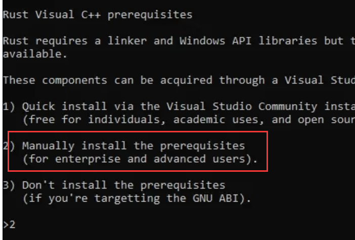
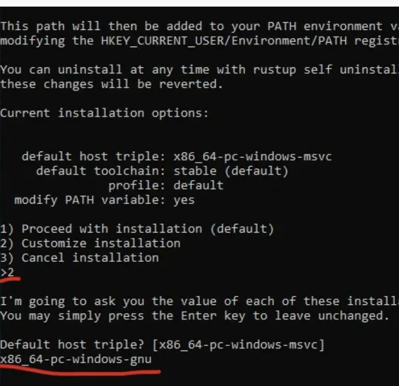

<p align="center">
    
</p>

<h1 align="center">
    ROG Config
</h1>

<p align="center">
    My ROG PC Configuration
</p>

> [!WARNING]
> Once ROG, forever ROG!!! 

# Device Info
- Model: ROG Strix G16 (2024)
- RAM: 32GB
- Storage: 2 * 1TB SSD
- OS: Windows 11
- CPU: Intel(R) Core(TM) i9-14900HX 2.20 GHz
- GPU: NVIDIA GeForce RTX 4070 Laptop GPU

# Configuration

## Use `G-Helper` instead of `Armoury Crate`
ASUS ROG Devices has `Armoury Crate` pre-installed, but it's too heavy. It always starts a bunch of services with the system startup.

So, let's rip out this s**t.

### Uninstall Armoury Crate
Download it from the official link: [https://dlsvr04.asus.com.cn/pub/ASUS/mb/14Utilities/Armoury_Crate_Uninstall_Tool.zip](https://dlsvr04.asus.com.cn/pub/ASUS/mb/14Utilities/Armoury_Crate_Uninstall_Tool.zip)

Or download it from Release: [https://github.com/Vincent-the-gamer/rog-config/releases/tag/uninstall](https://github.com/Vincent-the-gamer/rog-config/releases/tag/uninstall)

### Install G-Helper

Download from the git repo: [seerge/g-helper](https://github.com/seerge/g-helper)

Unzip it, and place the only `GHelper.exe` to your favorite folder, then run it.

If you don't have dotnet(.NET) runtime, it will automatically download the installer for you, 
install it and then install G-Helper.

Finally, use `G-Helper` to manage your PC.

Have fun!

# Development
I'm also gonna use this powerful beast for coding.

## Rust

Install Rust environment with `msys2` and `x86_64-pc-windows-gnu` toolchain, because I extremely hate MSVC.

### Install msys2

Download it from [https://www.msys2.org/](https://www.msys2.org/)

Install and open it, you'll get a shell window.

Then:

- Update database:
```shell
pacman -Sy && pacman -Syu
```

- Install `mingw-w64-x86_64-toolchain`
```shell
pacman -S mingw-w64-x86_64-toolchain
```

- Add `path\to\your\msys2\mingw64\bin` to PATH

- Run `gcc --version` to check.

### Install Rust
On Windows, you need to download the installer.

[https://www.rust-lang.org/learn/get-started](https://www.rust-lang.org/learn/get-started)

Run it, then:

- Choose `Manually install prerequisites` at beginning.
    
- Choose `Custom installation` when you asked for proceed with installation, 
and input `x86_64-pc-windows-gnu`. 
    
- Proceed with installation now.

Finally, config your mingw64 in cargo config file.
```toml
# /path/to/.cargo/config
[target.x86_64-pc-windows-gnu]
linker = "path\\to\\msys2\\mingw64\\bin\\gcc.exe"
ar = "path\\to\\msys2\\mingw64\\bin\\ar.exe"
```

# More
If any update, I will continue this document.